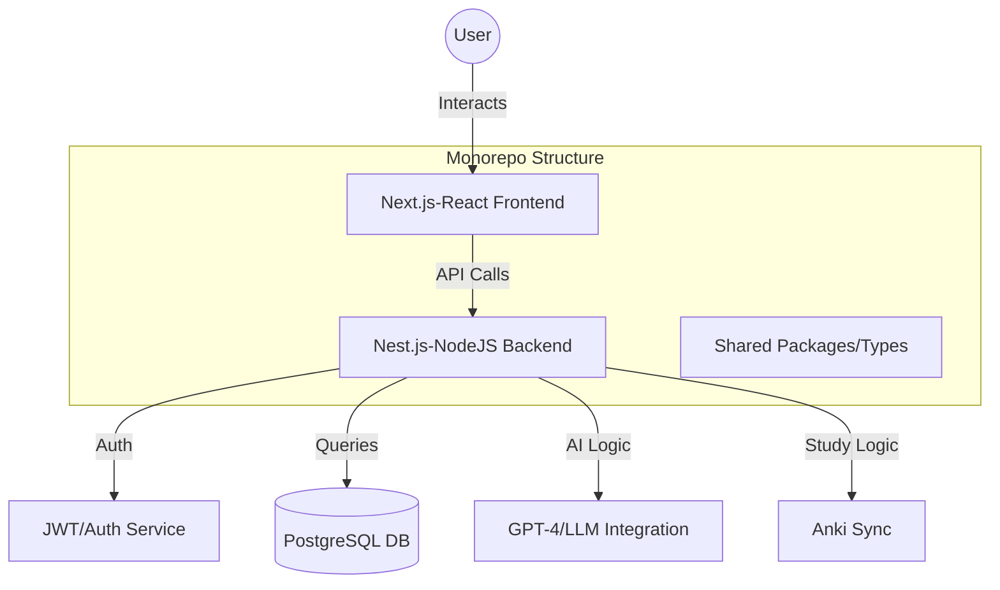

# 🚀 LangForge


> **EN:** Language learning platform focused on daily study consistency and JLPT progression.  
> **PT:** Plataforma de aprendizado de idiomas focada em consistência de estudo diário e progressão para o JLPT.

### 🇯🇵 <ruby>日本語<rt>にほんご</rt></ruby> (JLPT N5/N4 Level)
これは <ruby>言語<rt>げんご</rt></ruby>の <ruby>学習<rt>がくしゅう</rt></ruby>の ための プラットフォームです。  
<ruby>毎日<rt>まいにち</rt></ruby> <ruby>日本語<rt>にほんご</rt></ruby>を <ruby>勉強<rt>べんきょう</rt></ruby>して、JLPTの ために <ruby>頑張<rt>gan-ba</rt></ruby>ります。  
この プロジェクトは <ruby>私<rt>wa-tashi</rt></ruby>の <ruby>毎日<rt>mai-nichi</rt></ruby>の ルーチンを <ruby>助<rt>tasu</rt></ruby>けます。

---

## 🎯 Purpose | Propósito
**EN:** It serves as a personal tool to ensure linguistic mastery  

**PT:** Serve como uma ferramenta pessoal para garantir a fluência linguística.

---

## 🧬 System Architecture | Arquitetura do Sistema

## 🧱 Tech Stack | Tecnologias

    Frontend: Next.js (React) | EN: Best for SEO. / PT: Melhor para SEO.

    Backend: NestJS (Node.js) | EN: Robust modular architecture. / PT: Arquitetura modular robusta.

    Database | Banco de Dados: PostgreSQL | EN: Relational data tracking. / PT: Rastreamento de dados relacionais.

    Language | Linguagem: TypeScript

    Monorepo: NPM Workspaces | EN: Scalable code sharing. / PT: Compartilhamento de código escalável.

## 📦 Project Structure | Estrutura do Projeto
```
apps/
  ├── api/        # NestJS backend (Core Logic)
  └── web/        # Next.js frontend (React UI)
packages/
  └── shared/     # Common Types and Utils
```
## 📚 Study System | Sistema de Estudo

* Vocabulary | Vocabulário
* Kanji | Ideogramas
* Reading | Leitura
* Daily consistency tracking | Controle de consistência diária


## 📈 Roadmap | Cronograma

* [x] Initial Monorepo Setup
* [ ] MVP (daily tasks + progress)
* [ ] JLPT structured content
* [ ] Pomodoro timer
* [ ] Progress Analytics dashboard
* [ ] Mobile app (React Native)
* [ ] Premium features


## 🛠️ Installation | Instalação
```bash
# Clone the repository | Clonar o repositório
git clone [https://github.com/SEU_USUARIO/LangForge.git]

# Install dependencies | Instalar dependências
npm install

# Run development mode | Rodar modo desenvolvimento
npm run dev
```

## 🤝 Contributing | Contribuição

Open for learning and contributions. | Aberto para aprendizado e contribuições.


## 📄 License | Licença

AGPL-3.0 - Protecting business logic and encouraging open-source contributions.| Protegendo a lógica de negócios e incentivando contribuições de código aberto.
